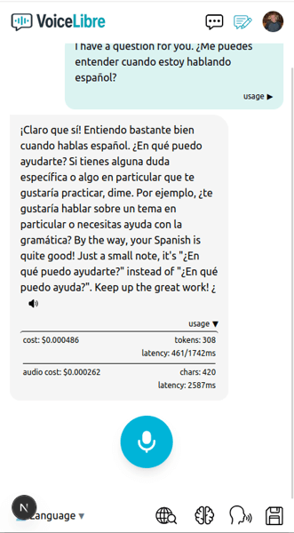
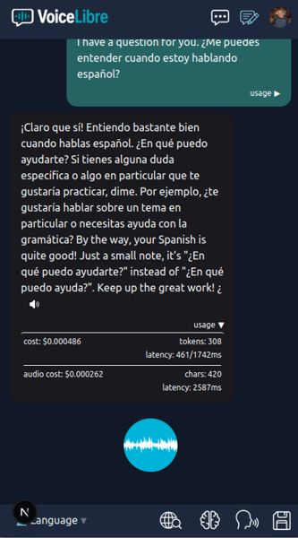

**Talk to AI like a human. In any language. Anywhere.**

Voice Libre is a powerful open-source conversational platform that enables seamless, multilingual voice-based interaction with AI. It’s designed to feel like a natural back-and-forth conversation — fully voice-operated, fully intuitive. From the simplicity of its interface to the depth of its features, Voice Libre gives users an intelligent assistant they can speak to like a real person.

Whether you're learning a language, getting answers, or building immersive characters with custom personalities and voices, Voice Libre makes the experience simple and engaging. It supports multilingual speech-to-text and text-to-speech within the same conversation, across sentences, making it a perfect tool for communication and education alike.

---

  <table>
    <tr>
      <td align="center">
         
        Light mode
      </td>
      <td align="center">
         
        Dark mode
      </td>
    </tr>
  </table>

#### NOTE from encryptShawn - Dev.0:

- This is an open-source project, free as long as you keep it open.
- I vibe-coded this MVP in 2 weeks; further refinement is still needed
- This is well documented with top of doc docuemntation and more indepth docs in `./lib/docs`. This helps you and AI understand and make better updates
- See the useguide and chatflow in the docs library for more details.
- The structure is fairly clean: no massive files, well-organized, and somewhat documented at the top of each doc and with comments at major functions — and in the docs folder.
- voiceLibre is focused on multi-lingual. I built this to help me with learning Spanish, so I could talk back and forth to AI between English and Spanish in the same question and be answered using both in the same response response.
- This is just a side project. I could use some help — if you like the project and are capable, submit a pr for a feature or reach out and let’s collaborate and unleash this app’s potential.

--- 

demo: https://voicelibre.com/  (Requires google login and APipie API key)

---

## Install

1. Configure .env

2. (run locally & needs node & NPM)
   2.1 (prep database) npx prisma generate & npx prisma migrate
   2.2 "npm build" & "npm run"
   OR
3. Run in a container "sh run.sh" (builds container, starts it on port 3000 using ../src/.env)

- Also good for Kubernetes, just configure config map with env settings.

---

## 🌐 Core Features

### Simple, Clean, Customizable Experience & Interface

- Minimalist approach to providing the core features users use
- Focus on voice engagement
- Leverages "Responders" to customize the user experience at the click of a dropdown
- Integrates an array of powerful, commonly used features

### 🎙️ Voice-First Experience

- Chat with AI using your voice rather than your keyboard
- Superior transcription for mixed-multilingual content
- Hands-free provides a human-like conversational experience

---

## 📱 User Interface

- Built mobile-first, fully responsive for desktop
- Header controls:
  - Chat
  - Chat Transcripts
  - Profile/User Menu

- Bottom bar controls:
  - **Microphone Button** – Start/stop recording
  - **Save** – Opens modal to save current chat
  - **Memory (🧠)** – Toggle memory mode
  - **Internet (🌐)** – Toggle Internet augmentation
  - **Hands-Free (🔁)** – Toggle hands-free mode
  - **Responder Dropdown** – Pick or edit AI responder profile
- Active toggles glow green

---

### ♻️ Hands-Free Mode

- Full-duplex conversation style: user speaks, AI replies, user responds again — just like human dialogue
- After AI response, auto-triggers next VAD recording
- Enables uninterrupted voice loop with a single tap

---

## 💾 Chat History & Transcripts

### 📝 Saving Chats

- Save any session as a named transcript
- Transcripts are stored with timestamps

### 📂 Transcript Management

- Access all historical transcripts from the **Transcriptions** panel
- Reload to restore the conversation to the chat window
- Optionally **Re-Remember** for memory integration

---

## 🧠 Responder Profiles

Each profile controls how the AI responds:

- System prompt
- AI model selection
- TTS voice and voice model
- Memory preferences (use of short-term and long-term)
- Response length
- Easily editable via UI
- Users can create and edit their own Responders

  ***

## 🌍 Internet Augmentation

- Toggle Internet Mode to enrich AI responses with real-time data
- Long-press to set depth: **Low**, **Medium**, **High**
- Perfect for news, current events, and research

---

## 🧠 Memory System

- Enable conversational memory
- Set responder memory settings per responder
- **Short-Term Memory**: Most recent "exact-state" message history
- **Long-Term Memory**: Vector similarity search for long-term context recall
- Long-press "Memory" to clear memory or re-remember loaded transcripts

##### Short click options to enable or disable them

##### Note: Long hold memory and internet to select options

---

## 📊 Usage Dashboard

- Track every single transaction or view aggregated report charts
- Click for more details

---

## 🔊 Text-to-Speech (TTS)

- AI responses can be spoken aloud
- Dozens of voices across languages
- Waveform visual effect while audio plays
- Audio playback is cached in-browser
- Audio usage stats displayed beneath each AI reply

---

## 🔐 Authentication & API Keys

- Google Login integration with profile image support
- Users can add their own API key for full access to Apipie services
- Future updates:
  - In-app purchases for API access
  - Launch on mobile app stores

---

## 🛠️ Admin

- Only admins can edit the system responders through the menu
- To set a user as admin, edit the `users` table in the database and set `admin: 1` or `true` for that account
- Admin panel is planned for the future

---

## 🧩 Languages supported

Afrikaans, Arabic, Armenian, Azerbaijani, Belarusian, Bosnian, Bulgarian, Catalan, Chinese, Croatian, Czech, Danish, Dutch, English, Estonian, Finnish, French, Galician, German, Greek, Hebrew, Hindi, Hungarian, Icelandic, Indonesian, Italian, Japanese, Kannada, Kazakh, Korean, Latvian, Lithuanian, Macedonian, Malay, Marathi, Maori, Nepali, Norwegian, Persian, Polish, Portuguese, Romanian, Russian, Serbian, Slovak, Slovenian, Spanish, Swahili, Swedish, Tagalog, Tamil, Thai, Turkish, Ukrainian, Urdu, Vietnamese, and Welsh.

## 🚀 Built with Apipie.ai

Voice Libre was made possible by [Apipie.ai](https://apipie.ai), a unified API platform for advanced AI services:

- Massive model selection for generation, voice, and vision
- Unified API for TTS, STT, AI chat, vector similarity, observability, and more
- Saved **days** of development time per feature — powerful services are accessible in **minutes**
- Thanks to Apipie.ai, this entire MVP was delivered in **10 days**, built using **React/Next.js**

---

## 🧩 Tech Stack

- **React / Next.js**
- **MySQL 8**
- App runs as a **single container**
- Made for mobile, works on **mobile** and **desktop**

---

## 👐 Open Source & Community

Voice Libre is open source and free to use.

This project is licensed under AGPL v3, which means it’s 100% free and open as long as you keep it open. To privatize the code, commercial licenses are available.

We hope this platform empowers developers, educators, language learners, and creators alike. Contributions are welcome — join us in making the future of voice-first AI accessible to all.

---
