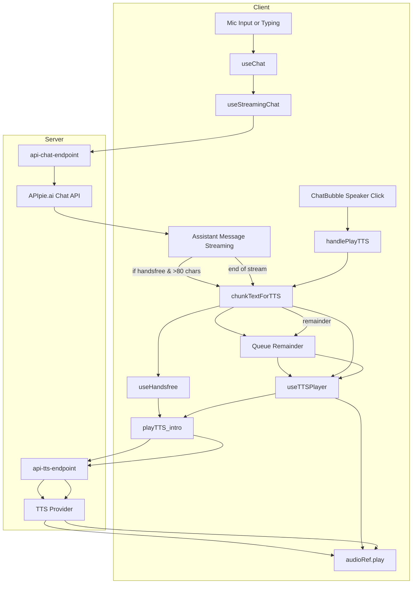
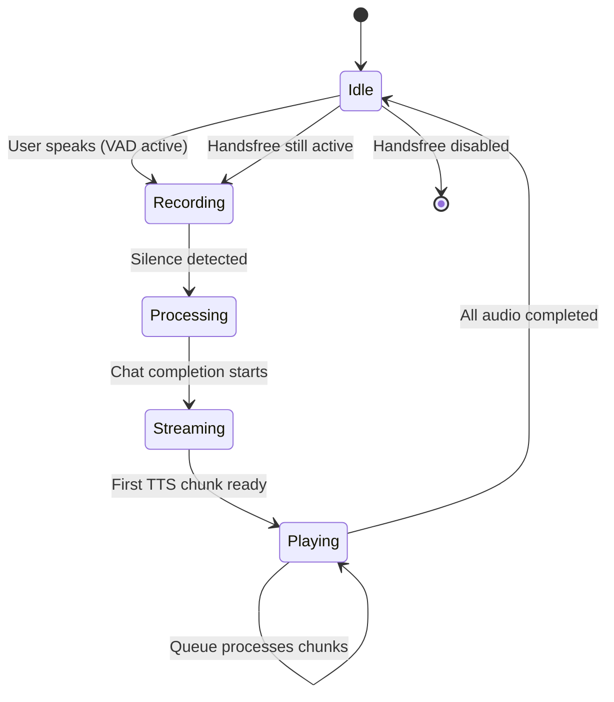

# ✅ Chat + TTS Playback: Full Architecture and Flow

---

## 🔷 Overview

VoiceLibre supports two coordinated modes for playing assistant responses via TTS:

| Mode      | Trigger                     | Playback Strategy                                     |
| --------- | --------------------------- | ----------------------------------------------------- |
| Manual    | Speaker icon click          | Plays full assistant message via TTS, chunked if long |
| Handsfree | Assistant message streaming | Starts TTS mid-stream with early chunk, queues rest   |

Both use the same chat state (`useChat`) and TTS queue system, but differ in trigger logic and timing.

---

## 📊 Mermaid Diagram: Chat + TTS Flow



---

## 🧭 Legend

- **Client**: React components and hooks
- **Server**: API endpoints and backend services
- Shared components like `chunkTextForTTS` are used by both modes.

---

## 📦 Architecture Summary

| File / Module         | Purpose                                                         |
| --------------------- | --------------------------------------------------------------- |
| `ChatPage.tsx`        | UI root, invokes `useChat`, renders `ChatBubble` + `MicButton`  |
| `ChatBubble.tsx`      | Renders messages, handles manual speaker TTS trigger            |
| `MicButton.tsx`       | Simplified control for manual recording and handsfree toggle    |
| `useChat.ts`          | Central state, message stream, memory, and TTS coordination     |
| `useStreamingChat.ts` | SSE response handler, parses stream and updates state           |
| `useHandsfree.ts`     | Centralized audio recording + handsfree TTS streaming logic     |
| `useTTSPlayer.ts`     | New module for all TTS chunk playback and queuing               |
| `chunkTextForTTS.ts`  | Splits long messages into intro + remainder for staged playback |
| `/api/chat`           | Streams assistant response from LLM                             |
| `/api/tts`            | Converts text to audio and returns `audio/mpeg`                 |

---

## 🧠 GPT Chat Streaming

### 1. `useChat → useStreamingChat.handleNewTranscription()`

- Sends input to `/api/chat` via fetch + SSE.
- Server streams tokens via `data:` lines:
  - `delta.content` tokens update assistant text.
  - `usage` saved for analytics and UI display.

### 2. `ChatPage + ChatBubble`

- `ChatPage` uses `messages[]` from `useChat`.
- Renders `<ChatBubble>` for each message.
- Streaming messages update live in bubble.

---

## 🔊 TTS Playback System

---

### 🟦 Manual Playback (Click Speaker Icon)

#### Trigger:

- Speaker icon click in `ChatBubble.tsx`

#### Flow:

1. `ChatBubble` calls `onPlayTTS → ChatPage → useChat.handlePlayTTS`
2. `useTTSPlayer.playTTS()` invoked
3. Internally calls `chunkTextForTTS(text)` → `[intro, remainder?]`
4. Fetches TTS for intro, plays immediately
5. If remainder exists, queues second chunk
6. Playback handled via a single `audioRef` shared across app

---

### 🟨 Handsfree Playback (Streaming Trigger)

#### Trigger:

- Active handsfree mode during assistant response streaming

#### Flow:

**During stream (early):**

1. `useChat` watches `messages` and `isStreaming`
2. Once assistant response is long enough (\~80 chars), runs `chunkTextForTTS()`
3. Triggers `useHandsfree.handlePlayTTS()` with intro chunk
4. Prevents multiple invocations via `ttsStartedRef`

**After stream ends:**

1. If remainder exists, queued via `playTTS()` in `useHandsfree`

---

## ✅ `useTTSPlayer.ts` – Playback & Queue Management

### Playback Flow

```ts
const playTTS = async (messageId, text, isHandsfree, onComplete) => {
  if (isPlaying || currentMessageId === messageId) return;

  const [intro, remainder] = chunkTextForTTS(text);
  await fetchAudio(introId, intro);
  if (remainder) await fetchAudio(remainderId, remainder);

  setupAudio(audioUrl, isHandsfree, onComplete);
  if (remainder) queueRef.current.push(...);
  setCurrentMessageId(messageId);
};
```

### Queue Mechanics

- First chunk plays immediately via `audioRef.play()`
- Remaining chunks pushed to `queueRef`
- `audio.onended` triggers processing of next chunk
- Queue state is reset when empty

### Playback Interruption and Cleanup

```ts
const stopTTS = () => {
  audioRef.current.pause();
  audioRef.current.src = "";
  queueRef.current = [];
  setCurrentMessageId(null);
  setIsPlaying(false);
};
```

---

## 🧩 State Tracking with Refs

| Ref Variable       | Purpose                                                     |
| ------------------ | ----------------------------------------------------------- |
| `audioRef`         | Persistent `HTMLAudioElement` across renders                |
| `queueRef`         | TTS chunk queue during playback                             |
| `currentMessageId` | Prevents duplicate playback per message                     |
| `isPlaying`        | Indicates if audio is active                                |
| `ttsStartedRef`    | Prevents re-triggering of TTS during stream or replay cycle |

---

## 🔁 Handsfree Loop (Full Cycle)

1. **Idle State**: Handsfree is enabled via UI toggle
2. **Recording Phase**: VAD starts when user speaks via `MicButton`
3. **Processing Phase**: Silence ends recording, audio is sent to `/api/transcribe`
4. **Assistant Phase**: Assistant response is streamed
5. **Playback Phase**: Once long enough, TTS begins playing intro
6. **Queue Phase**: Remainder is queued and played sequentially
7. **Loop Restart**: When playback ends, VAD resumes recording

---

## 🗺️ State Diagram: Handsfree Loop



---

### ✅ **VAD Lifecycle and Control in Handsfree Mode**

1. **Handsfree Mode Activation**
   - User enables handsfree mode (`setIsHandsfreeActive(true)`).
   - `ChatPage` passes `isHandsfreeActive` to `<MicButton />`.

2. **VAD Initialization**
   - In handsfree mode, `MicButton` triggers `useHandsfree` to start VAD via `startVAD()`.
   - `startVAD()` sets up microphone input and RMS-based volume detection.
   - When speech is detected, `onStart()` is called.

3. **Recording Start (onStart)**
   - `onStart()` starts `MediaRecorder`, sets `isRecording = true`.
   - Audio capture is **only** initiated in response to `onStart()`.

4. **Recording Stop (onStop)**
   - Silence for `silenceDuration` triggers `onStop()`.
   - Stops recording, sends audio to transcription, disarms VAD.

5. **VAD Paused During TTS**
   - While TTS is playing (intro + remainder), VAD stays disabled to prevent re-triggering.

6. **VAD Reactivated After TTS**
   - Only after the final TTS chunk completes does `onComplete()` rearm VAD.

---

### ✅ VAD Control Summary

| Trigger                      | Effect                       | Mechanism                             |
| ---------------------------- | ---------------------------- | ------------------------------------- |
| `isHandsfree` becomes `true` | Starts VAD                   | `startVAD()` in `useHandsfree`        |
| Voice detected               | Starts recording             | `onStart()` → `MediaRecorder.start()` |
| Silence after speech         | Stops recording, disarms VAD | `onStop()` → `stopRecordingAndSend()` |
| Handsfree manually disabled  | Stops VAD if active          | `vadStopRef.current?.()`              |
| TTS finishes (last chunk)    | Rearms VAD                   | `onComplete()` → `startVAD()`         |

---

### ✅ Flow Summary (First Handsfree Run)

```plaintext
1. Handsfree enabled → VAD armed
2. User speaks → VAD triggers onStart → recording starts
3. User stops speaking → VAD triggers onStop → recording ends, VAD disarmed
4. Assistant replies → TTS plays intro + remainder chunks (via audioRef)
5. After final chunk → onComplete runs → VAD rearmed for next interaction
```

```

```
